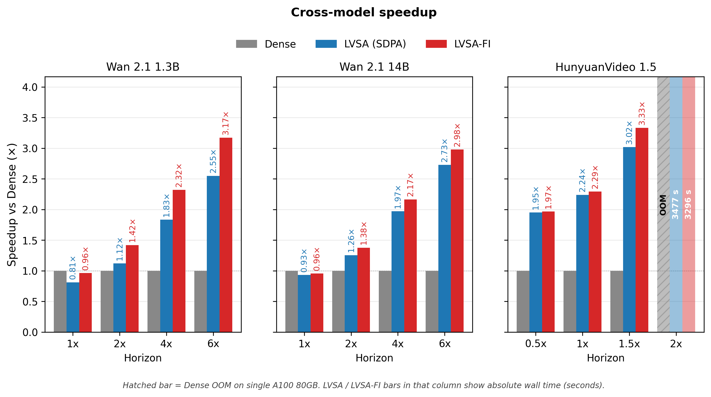
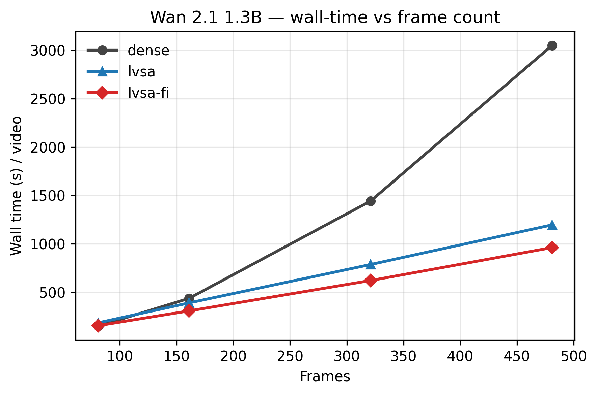
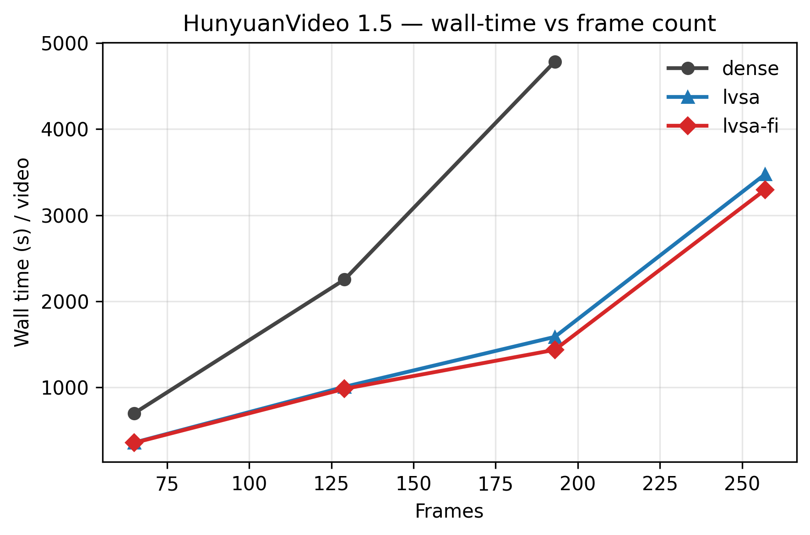
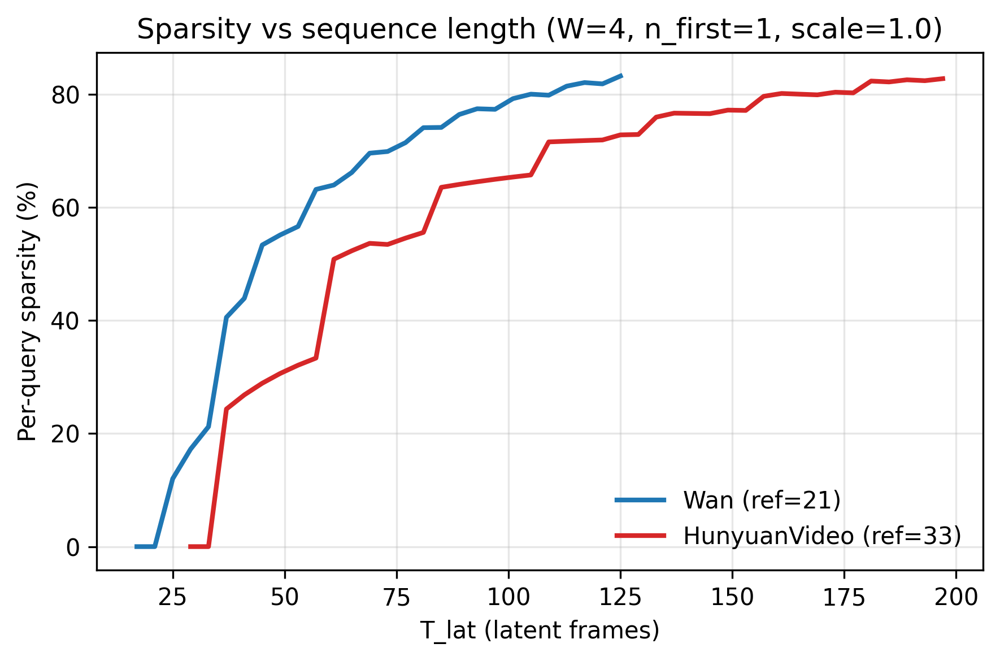

# LVSA — Long-Video Sparse Attention

**Training-free block-sparse attention for video diffusion transformers.** Speeds up long-video generation by up to **3.81×** on HunyuanVideo at 1.5× the training horizon and **3.14×** on Wan 1.3B at 6× horizon, and enables generation beyond the training horizon at lengths where dense attention OOMs on 80 GB GPUs — all with no fine-tuning, no model modifications.

<p align="center">
  
</p>

## Features

- **Training-free**: drop-in replacement for the attention layer; no weight changes.
- **Model-agnostic**: same engine drives single-stream (Wan), dual-stream (HunyuanVideo), and joint-attention (CogVideoX) DiTs via a thin per-model adapter.
- **Single-GPU and multi-GPU**: context-parallel (Ulysses) on top of standard PyTorch distributed primitives.
- **vLLM-Omni integration**: production-ready plugin for the [vLLM-Omni](https://github.com/vllm-project/vllm-omni) serving framework — enable LVSA with one environment variable.
- **Two backends**: SDPA (always-on) and FlashInfer (block-sparse CSR, fastest at long sequences).
- **Hardware-agnostic**: SDPA path runs on CUDA *and* Ascend NPU (via `torch_npu`). FlashInfer is CUDA-only.
- **Quality-positive at extended lengths**: rotating-keyframe pattern actively prevents the looping/static-output failure mode dense attention exhibits beyond the training horizon.
- **Composable with RIFLEx**: optional RoPE-frequency rescaling for additional extrapolation headroom.

## Headline numbers

### SotA comparison — Wan 2.1 1.3B, 5 prompts × 3 horizons, single A100 80GB, 50 steps

| Method | $2\times$ (165f) | $3\times$ (249f) | $4\times$ (333f) | Quality (VQeval comp.) at 4× |
|---|---|---|---|---|
| Dense | 566 s | 1145 s | 1930 s | 52.4 |
| RIFLEx | 564 s | 1149 s | 1931 s | 53.6 |
| UltraViCo *(arXiv 2511.20123)* | 741 s | 1544 s | 2621 s | 58.8 |
| **LVSA (SDPA)** | 502 s | 796 s | 1021 s | **62.4** |
| **LVSA + FlashInfer** | **395 s** | **621 s** | **802 s** | **62.3** |

- **LVSA-FI is 1.43× / 1.84× / 2.41× faster than Dense at 2× / 3× / 4×.**
- **LVSA-FI is 1.88× / 2.49× / 3.27× faster than UltraViCo** — the strongest published baseline for length extrapolation.
- VQeval composite Δ vs Dense: **+6.5 / +11.2 / +9.9**. VBench-Long `imaging_quality` Δ vs Dense: **+0.09 / +0.04 / +0.10**.

### HunyuanVideo 1.5 (single A100, 50 steps, 5-prompt mean)

| Frame count | Ratio | Dense | LVSA | Speedup |
|---|---|---|---|---|
| 65 | 0.5× | 804 s | 459 s | **1.75×** |
| 129 | 1× *(training reference)* | 2476 s | 932 s | **2.66×** |
| 193 | 1.5× | 5191 s | 1361 s | **3.81×** |
| 257 | 2× | **OOM** | 1617 s | **LVSA-only (capability)** |

### Wan 2.1 1.3B latency scaling (single A100, 50 steps, single-prompt sweep)

| Frame count | Ratio | Dense | LVSA | Speedup |
|---|---|---|---|---|
| 81 | 1× | 168 s | 194 s | 0.87× *(no benefit at training horizon)* |
| 161 | 2× | 492 s | 347 s | 1.42× |
| 321 | 4× | 1610 s | 700 s | **2.30×** |
| 481 | 6× | 3369 s | 1072 s | **3.14×** |

<p align="center">
  
  
</p>

## Installation

```bash
# Core library
pip install -e .

# vLLM-Omni plugin (optional — for serving)
pip install -e lvsa-vllm-omni/
pip install "vllm==0.18.0" "vllm-omni==0.18.0"   # validated pair

# VQeval (optional — for evaluating generated videos)
pip install -e vqeval/
```

For Docker-based deployment, see [`docs/install.md`](docs/install.md).

## Quick start

### Single-GPU generation with Wan 2.1 1.3B at 4× horizon

```bash
python examples/wan_generate.py \
    --model /path/to/Wan2.1-T2V-1.3B-Diffusers \
    --prompt "A dog running in the forest." \
    --num-frames 321 \
    --lvsa --flashinfer --rotate-keyframes --auto-keyframes \
    --output-name dog_4x.mp4
```

### vLLM-Omni serving with HunyuanVideo 1.5

```bash
docker run --gpus '"device=0"' --ipc=host --shm-size=2g \
    -v /path/to/models:/models \
    -e DIFFUSION_ATTENTION_BACKEND=LVSA \
    -e LVSA_AUTO_KEYFRAMES=1 \
    -e LVSA_REFERENCE_LATENT_FRAMES=33 \
    lvsa-vllm-omni:latest \
    python lvsa-vllm-omni/scripts/gen_hunyuan.py \
        --model /models/HunyuanVideo-1.5-Diffusers-480p_t2v \
        --num-frames 193 \
        --prompt "Ocean waves crashing on a rocky coastline." \
        --output-name ocean_193f.mp4
```

See [`docs/quickstart.md`](docs/quickstart.md) for the complete first-run walkthrough.

## How it works (one-paragraph version)

Each query frame attends to a small set of **global anchor frames** (the first N frames + periodic keyframes) plus a **local sliding window**. The keyframe grid **rotates one position per denoising step**, so every frame eventually serves as a global anchor — preventing the "frozen video" failure mode dense attention exhibits at extended lengths. The per-query attention budget is bounded (`O(N · C)` instead of `O(N²)`), so wall-clock scales linearly while quality stays competitive with dense.

<p align="center">
  
</p>

For the algorithmic details, see [`docs/architecture.md`](docs/architecture.md).

## Documentation

| Doc | Topic |
|---|---|
| [`docs/install.md`](docs/install.md) | Install paths (pip / Docker), CUDA + Python versions, NPU notes |
| [`docs/quickstart.md`](docs/quickstart.md) | First generation in 3 minutes |
| [`docs/tuning.md`](docs/tuning.md) | `sparsity_scale`, `reference_latent_frames`, picking knobs for your model |
| [`docs/troubleshooting.md`](docs/troubleshooting.md) | Silent fallbacks, OOM, output-path bugs, common gotchas |
| [`docs/architecture.md`](docs/architecture.md) | Adapter pattern, how to add a new model |
| [`docs/VLLM_OMNI_INTEGRATION.md`](docs/VLLM_OMNI_INTEGRATION.md) | How the vllm-omni plugin is wired |
| [`lvsa-vllm-omni/README.md`](lvsa-vllm-omni/README.md) | Plugin reference: env vars, configuration, distributed serving |
| [`benchmarks/README.md`](benchmarks/README.md) | Reproduce the headline numbers |
| [`vqeval/README.md`](vqeval/README.md) | Video-quality assessment used in the paper |

## Supported models

| Model | Size | Status | `LVSA_REFERENCE_LATENT_FRAMES` |
|---|---|---|---|
| Wan 2.1 / 2.2 T2V | 1.3B, 14B | **stable** | `21` |
| HunyuanVideo 1.5 | — | **stable** | `33` |
| CogVideoX | 5B | experimental (correctness only — no speedup) | `13` |

Adding a new model takes ~200 lines (one adapter file). See [`docs/architecture.md`](docs/architecture.md).

## Examples

```
examples/
├── wan_generate.py           Wan 2.1 / 2.2 generation (1.3B and 14B)
├── hunyuan_generate.py       HunyuanVideo 1.5 generation
├── cogvideox_generate.py     CogVideoX 5B (experimental)
└── vllm_omni_serve.sh        Minimal vllm-omni serving recipe
```

See [`examples/README.md`](examples/README.md) for arguments and example invocations.

## Tests

```bash
pip install -e ".[dev]"
pytest tests/ lvsa-vllm-omni/tests/ -v
```

CPU-only tests; no GPU required to verify the install. Companion VQeval tests live at `vqeval/tests/`.

## Citation

TODO

## License

Apache-2.0 — see [`LICENSE`](LICENSE).

Model weights are downloaded separately from HuggingFace under their respective licenses ([Wan](https://huggingface.co/Wan-AI), [HunyuanVideo](https://huggingface.co/hunyuanvideo-community/HunyuanVideo-1.5-Diffusers-480p_t2v)).

## Related projects

- [vLLM-Omni](https://github.com/vllm-project/vllm-omni) — the serving framework LVSA plugs into.
